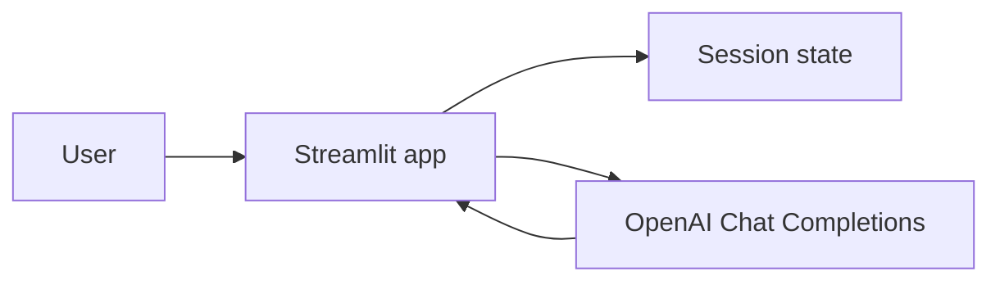

# Streamlit OpenAI Chatbot

**Status: Learning project**

A small Streamlit chatbot that sends conversation history to OpenAI's `gpt-3.5-turbo` model and streams the assistant response into the browser. It demonstrates the minimum loop needed for a conversational LLM UI: collect input, preserve session messages, call a model, and render the response.

## Live Demo

[Open the deployed Streamlit app](https://app-openai-chatbot-edkp7lvx2nwjnz4gatqk5u.streamlit.app/)

The public app and UI were verified. Configure `OPENAI_API_KEY` in Streamlit Cloud **Settings → Secrets** before using the chat workflow.

## What It Demonstrates

- Streamlit chat UI with `st.chat_input` and `st.chat_message`
- Session-based conversation history
- OpenAI Chat Completions streaming
- Password-style API-key input at runtime

This is intentionally a compact example, not a production assistant. It has no persistence, authentication, retrieval, moderation, evaluation, or automated tests.

## Architecture



## Requirements

- Python 3.9+
- An OpenAI API key
- Packages listed in `requirements.txt`: `streamlit` and `openai`

## Run Locally

```bash
python -m venv .venv
# Windows: .venv\Scripts\activate
# macOS/Linux: source .venv/bin/activate
pip install -r requirements.txt
streamlit run streamlit_app.py
```

For local Streamlit secrets, create `.streamlit/secrets.toml`:

```toml
OPENAI_API_KEY = "your-api-key"
```

The app reads that secret first, then checks `OPENAI_API_KEY`, and finally offers the existing password input. Copy `.streamlit/secrets.toml.example` as a template. On Streamlit Community Cloud, add the same key under **Settings → Secrets**. Never commit a real key.

## Limitations and Future Improvements

- Add environment-based secret management and never log credentials.
- Add conversation limits, error handling, retry policy, and usage controls.
- Add a system prompt, model configuration, persistence, tests, and evaluation.
- Add retrieval only if the application needs knowledge grounded in documents.

## Resume Relevance

Demonstrates Python, Streamlit, OpenAI API integration, streaming responses, and session-state management in a small LLM application.

## Author

**Sunil Javadi**

- [GitHub](https://github.com/suniljavadi)
- [Portfolio](https://github.com/suniljavadi/sunil-portfolio)
- [LinkedIn](https://www.linkedin.com/in/sunil-javadi/)
